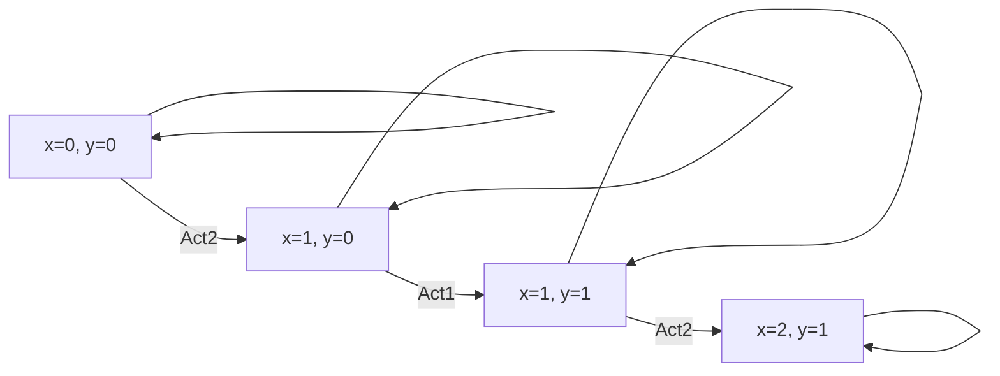
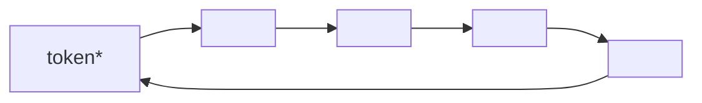

## TLA+ : TD

#### Factorial

1. Write a function defining the factorial of `x`.
2. Write a program that calculates the factorial of `x`:
   - iteratively, by successive multiplications/decrements;
   - not deterministically, by building iteratively the product of the integers between `1` and `x` (two versions: with **set**, with **table**)

Factorial = write a transition systeme with a variable "res"(result) tel que dans toute execution.

(1) En une transition avec un operateur: 

```mermaid
graph LR
N=5 --> res=120
res=120 --> res=120
```

```
------------- MODULE fact1 ------------
CONSTANT N
ASSUME N \in Nat /\ N > 0
VARRIABLE res
Init == Ture
Next == res' = N!		(* N 的阶乘 *)
Spec == Init /\ [] [Next]_res
```

(2) En une suite de multiplication

```mermaid
graph LR
res=1,x=5 --> res=1,x=5
res=1,x=5 --> res=5,x=4
res=5,x=4 --> res=5,x=4
res=5,x=4 --> res=20,x=3
res=20,x=3--> res=20,x=3
res=20,x=3 --> res=60,x=2
res=60,x=2 --> res=60,x=2
res=60,x=2 --> res=120,x=1
res=120,x=1 --> res=120,x=1
```

```
------------- MODULE fact2 ------------
CONSTANT N
ASSUME N \in Nat /\ N > 0
VARIABLE res, x
Init == res = 1 /\ x = N
Next == x > 0
		/\ res' = res * x
		/\ x' = x - 1
Spec == Init /\ [] [Next]_res
```

(3) En une suite de multiplication simple ou double

```mermaid
graph LR
res=1,x=5 --> res=1,x=5
res=1,x=5 --A1--> res=5,x=4
res=1,x=5 --A2--> res=20,x=3
res=5,x=4 --> res=5,x=4
res=5,x=4 --A1--> res=20,x=3
res=5,x=4 --A2--> res=60,x=2
res=20,x=3--> res=20,x=3
res=20,x=3 --A1--> res=60,x=2
res=20,x=3 --A2--> res=120,x=1
res=60,x=2 --> res=60,x=2
res=60,x=2 --A1--> res=120,x=1
res=120,x=1 --> res=120,x=1
```

```
------------- MODULE fact3 ------------
CONSTANT N
ASSUME N \in Nat /\ N > 0
VARIABLE res, x
Init == res = 1 /\ x = N
A1 == /\ x >= 1
		/\ x' = x - 1
		/\ res' = res * x
A2 == /\ x >= 2
		/\ x' = x - 2
		/\ res' = res * x * (x-1)
Next == A1 \/ A2
Spec == Init /\ [] [Next]_res
```

(4) Bizarrement

```
------------- MODULE fact4 ------------
CONSTANT N
ASSUME N \in Nat /\ N > 0
VARIABLE res, x
Init == res = 1 /\ x = N
Next == x > 0
		/\ x' = x - 1
		/\ res' = res * x
Spec == Init /\ [] [Next]_res
```

(5) 

```
------------- MODULE fact5 ------------
CONSTANT N
VARIABLE res, x 
(* table i \in 1..N -> BOOLEAN 来表示我们使用已经在阶乘计算中用到了当前的变量x[i] *)
Init == res = 1
		/\ x = [i \in 1..N |-> FALSE] (* DOMAIN x = 1..N /\ i \in 1..N: x[i] = FALSE *)
Mult(p) == (* multipule res par p, si possible *)
		/\ \neg x [P]
		/\ res' = res * p
		/\ x' = [x EXCEPT ![P] = TURE]
Next == \E i \in 1..N: Mult(i)
Spec == Init /\ [][Next]

```


#### xyplus1

1. Write a program consisting of two variables x and y, with two actions, one which transfers the value of x to y, the other which transfers the value of y + 1 to x .
2. Formulate the properties (intuitively) verified by this program.
3. Formally prove the invariance property.
4. Formally prove the liveness property.

```
------------- MODULE xyplus1 ------------
EXTENDS Naturale
VARIABLE x, y
Init == x = 0 /\ y = 0
Act1 == /\ y' = x
		/\ UNCHANGED x
Act2 == /\ x' = y + 1
		/\ UNCHANGED y
Next == Act1 \/ Act2
Spec == Init /\ [][Next] /\ WF(Act1) /\ WF(Act2)
```

##### What proprities do Spec verfier?

- `TypeOK == [](x \in Nat /\ y \in Nat)`
- `XSuperieur == [](x >= y)`
- `Ecast == [](0 <= x-y <= 1)`
- `CroissantX == [](x' >= x)`
- `XSupY == []<>(x > y)` [il faudra de l'equite]
- `CroissantXbis == \A k \in Nat: [](x >= k => [](x >= k))`
- `XVivace == \A k \in Nat: <>(x >= k)` [sous reserve d'equite]
- `ToutEntieAtteint == \A k \in Nat: <>(x = k)`



##### Preuve de $\Box (0 \le x-y \le 1)$ :

Soit $I \triangleq \Box (0 \le x-y \le 1)$ , 

* `Init => I`

  `(x = 0 /\ y = 0) 	=>	 (0 <= x-y <= 1)`

* `I /\ Next => I'`

  `I /\ Act1 => I'`

  `0 <= x-y <= 1 /\ y' = x /\ x' = x		=> 		0 <= x'-y' <= 1`

- `I /\ UNCHANGED (y)  =>  I'`

##### Preuve de $\forall k \in Nat:\;\Diamond (x \ge k)$

$\forall k ,\;x \ge k \rightsquigarrow x \ge k+1$

- $x \ge k \rightsquigarrow y \ge k$  (* Act1 + WF(Act1) *)

  $y \ge k \rightsquigarrow x \ge k+1$  (* Act2 + WF(Act2) *)

  $x \ge k \rightsquigarrow x \ge k+1$  (* transitivite de $\rightsquigarrow$ *)

  $x \ge 0 \rightsquigarrow x \ge k+1$  (* induction sur k *)

  $true\; \rightsquigarrow x \ge k+1$  (* par TypeOK *)

  $=\; \Box \Diamond (x \ge k+1)$

  $\to \Diamond (x \ge k+1)$


#### The man, the wolf, the sheep and the cabbage

On one bank are a Man, a Wolf, a Sheep and a Cabbage. A boat allows you to cross, but it only has two places, and only the man can row.
Only the presence of Man can ensure a peaceful coexistence between the Wolf and the Sheep on the one hand, and between the Sheep and the Cabbage on the other.
Model this problem, with the negation of the expected result as a safety property, so that its invalidation demonstrates the existence of a solution.

**Resolution de problem / jeu**

- describe the possible states
- describe the possible transitions
- describe the win state
- verifer if it is accessible

```
|-----------------------|-----------------------|-----------------------|
|				Riverside				|					River					|				Riverside				|
|												|												|												|
|				man, wolf				|					Boat					|												|
|			sheep, cabbage		|				------->				|												|
|												|												|												|
|-----------------------|-----------------------|-----------------------|
```

Rules :

 	1. only the `man` can paddle;
 	2. `wolf + sheep` without `man` , it is IMPOSSIBLE
 	3. `sheep + Cabbage` without `man` , it is IMPOSSIBLE
 	4. the Boat only has 2 places

Solution :

(1) Describe states:

- position : `G(Left)` and `D(Right)`

- Boat always with `man`

- variables of entity: 

  `VARIABLE homme, loup, mouton, chou (* \in {"G","D"}*)`

(2) Describle rules : 

- `pasManger == (loup = mouton => homme = loup) /\ (mouton = chou => homme = chou)`

```
------------- MODULE HLMC ------------
VARIABLE homme, loup, mouton, chou (* \in {"G","D"}*)
inv(r) == IF r = "G" THEN "D" else "G"
PasDeSolution == [] \neg (homme="D", loup="D", mouton="D", chou="D")
pasManger == (loup = mouton => homme = loup)
		/\ (mouton = chou => homme = chou)
Init == (homme="G", loup="G", mouton="G", chou="G")

bougerH == /\ homme' = inv(homme)
		/\ UNCHANGED <loup, mouton, chou>
		/\ pasManger
bougerHM == /\ homme = mouton
		/\ homme = inv(homme)
		/\ mouton = inv(mouton)
		/\ UNCHANGED <loup, chou>
		/\ pasManger
bougerHL == /\ homme = loup
		/\ homme = inv(homme)
		/\ loup = inv(loup)
		/\ UNCHANGED <mouton, chou>
		/\ pasManger
bougerHC == /\ homme = chou
		/\ homme = inv(homme)
		/\ chou = inv(chou)
		/\ UNCHANGED <mouton, loup>
		/\ pasManger
		
Next == bougerH \/ bougerHM \/ bougerHL \/ bougerHC
Spec == Init /\ [][Next]
```


#### Mutual exclusion with circulating token

**Aim**: to describe mutual exclusion with circulation of a token on a ring.

**Objective**: to obtain a proven code that can be implemented on a distributed system without common memory.

**Solution**:

Exclusion avec un jeton circulant.



le jeton visit les sites. les sites qui a le jeton peut entrer en exclusion mutuelle.

**Proprities** :

- $ExclusionMutuelle \triangleq \Box (\forall i,j \in 0..{N-1} : etat[i] = Eating \; \land \; etat[j]=Eating \quad \Rightarrow \quad i=j)$  **OR**  $\Box (Candinality(\{ i \in 0..N-1: \; etat[i] =Eating\}) \le 1)$

- $AbsenceDeFamine \triangleq \forall i \in 0..N-1 : etat[i] = Hungry \rightsquigarrow etat[i] = Eating$

  $(*\;ok\;avec\;SF(entrer(i))\land WF(sortir(i))\;*)$

- $AbsenceDInterblocage \triangleq (\exist i:etat[i]=Hungry) \rightsquigarrow (\exist j:etat[j]=Eating)$

  $(*\;ok\;avec\;WF(entrer(i))\land WF(sortir(i))\;*)$

- $\Box (\forall i \in 0..N-1 : etat[i]=Eating) \quad \Rightarrow \quad jeton=i$

- $JetonAnneau \triangleq \forall i \Box (jeton=i) \quad \Rightarrow \quad (jeton=i) \mathcal{U} (jeton=(i+1)\%N)$

- $JetonVaPartour \triangleq \Box \Diamond (jeton=i)$

```
------------- MODULE jeton ------------
(* Pas encore de jeton: un site peut entrer en exclusion mutuelle si auncun autre n'y est*)
CONSTANT N (* nb de sites *)
Thinking == 1
Hungry == 2
Eating == 3
VARIABLE etat, (* \in [0..N-1 -> {Thinking, Hungry, Eating}] *)
		jeton (* \in 0..N-1 *)
		
Init == etat = [i \in 0..N-1 |-> Thinking]
demander(i) == /\ etat[i] = Thinking
		/\ etat' = [etat EXCEPT ![i]=Hungry]
		/\ UNCHANGED jeton
entrer(i) == /\ etat[i] = Hungry
		/\ jeton = 1
		/\ etat' = [etat EXCEPT ![i]=Eating]
		/\ UNCHANGED jeton
sortir(i) == /\ etat[i] = Eating
		/\ etat' = [etat EXCEPT ![i]=Thinking]
		/\ UNCHANGED jeton
bouger(i) == /\ jeton = 1
		/\ etat[i] != Eating
		/\ jeton' = (i+1)%N
		/\ UNCHANGED etat
Next == \E i \in 0..N-1: demander(i) \/ entrer(i) \/ sortir(i) \/ bouger(i)
Fairness == \A i \in 0..N-1: SF(entrer(i)) /\ WF(sortir(i)) /\ WF(bouger(i))
Spec == Init /\ [][Next]_etat /\ Fairness
```

Necessary fairness for `AbsenceDeFamine` : $\forall i \in 0..N-1: SF(entier(i)) \land SF(bouger(i)) \land WF(sortir(i))$

Necessary fairness for `AbsenceDInterblocage` : $\forall i \in 0..N-1: SF(entier(i)) \land WF(bouger(i)) \land WF(sortir(i))$

**Comment se passer de l'equite forte?**

- Pour renplacer `SF(entrer(i))` par `WF(entrer(i))`, il faut renplacer le jeton de partir alors que entrer est faisable.

  ```
  bouger(i) == /\ jeton = 1
  		/\ etat[i] \notin {Hungry, Eating}
  		/\ jeton' = (i+1)%N
  		/\ UNCHANGED etat
  ```

- Pour renplacer `SF(bouger(i))` par `WF(bouger(i))` ...

  ```
  sortir(i) == /\ etat[i] = Eating
  		/\ etat' = [etat EXCEPT ![i]=Thinking]
  		/\ jeton' = (i+1)%N
  ```

 


A new proprity: $JetonUnique \triangleq \Box (Candinality(\{ i \in 0..N-1:jeton[i]\})=1)$

```
------------- MODULE jeton3 ------------
(* Pas encore de jeton: un site peut entrer en exclusion mutuelle si auncun autre n'y est*)
CONSTANT N (* nb de sites *)
Thinking == 1
Hungry == 2
Eating == 3
VARIABLE etat, (* \in [0..N-1 -> {Thinking, Hungry, Eating}] *)
		jeton (* \in 0..N-1 -> Boolean*)
		
Init == /\ etat = [i \in 0..N-1 |-> Thinking]
		/\ \E j \in 0..N-1: jeton = [[i \in 0..N-1: |-> FALSE] EXCEPT ![j] = TRUE]
		/\ jeton \in {[i \in 0..N-1 |-> i=j]: j \in 0..N-1}
demander(i) == /\ etat[i] = Thinking
		/\ etat' = [etat EXCEPT ![i]=Hungry]
		/\ UNCHANGED jeton
entrer(i) == /\ etat[i] = Hungry
		(* /\ \A j \in 0..N-1: etat[j] != Eating*)
		/\ jeton[i]
		/\ etat' = [etat EXCEPT ![i]=Eating]
		/\ UNCHANGED jeton
sortir(i) == /\ etat[i] = Eating
		/\ etat' = [etat EXCEPT ![i]=Thinking]
		/\ jeton' = [jeton EXCEPT ![i]=FALSE ![(i+1)%N]=TRUE]
bouger(i) == /\ jeton[i]
		/\ etat[i] \in {Eating, Hungry}
		/\ jeton' = [jeton EXCEPT ![i]=FALSE ![(i+1)%N]=TRUE]
		/\ UNCHANGED etat
		
Next == \E i \in 0..N-1: demander(i) \/ entrer(i) \/ sortir(i) \/ bouger(i)
Fairness == \A i \in 0..N-1: WF(entrer(i)) /\ WF(sortir(i)) /\ WF(bouger(i))
Spec == Init /\ [][Next]_<<etat,jeton>> /\ Fairness
```

