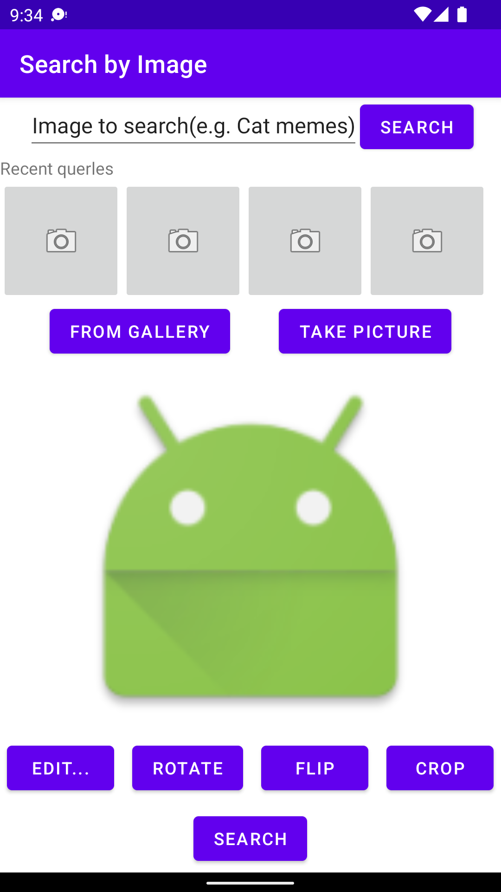

## Examen_2019 - Programmation mobile

#### Q1.1 Layouts

##### <1> XML File

XML文件如下所示：

```xml
    <LinearLayout
        android:layout_width="match_parent"
        android:layout_height="match_parent"
        android:orientation="vertical"
        android:gravity="center|top">

        <LinearLayout
            android:orientation="horizontal"
            android:layout_width="match_parent"
            android:layout_height="wrap_content"
            android:gravity="center|top">

            <EditText
                android:id="@+id/editText_Search"
                android:layout_width="wrap_content"
                android:layout_height="wrap_content"
                android:gravity="center|top"
                android:text="@string/editView_Search"></EditText>

            <Button
                android:id="@+id/btn_Search"
                android:layout_width="wrap_content"
                android:layout_height="wrap_content"
                android:layout_gravity="center|top"
                android:text="@string/btn_Search"></Button>

        </LinearLayout>

        <TextView
            android:id="@+id/textView_Recent"
            android:layout_width="match_parent"
            android:layout_height="wrap_content"
            android:layout_gravity="left"
            android:text="@string/textView_Recent"></TextView>

        <LinearLayout
            android:orientation="horizontal"
            android:layout_width="match_parent"
            android:layout_height="wrap_content">

            <ImageButton
                android:id="@+id/imageBtn1"
                android:layout_width="100dp"
                android:layout_height="100dp"
                android:clickable="true"
                android:src="@android:drawable/ic_menu_camera"></ImageButton>

            <ImageButton
                android:id="@+id/imageBtn2"
                android:layout_width="100dp"
                android:layout_height="100dp"
                android:clickable="true"
                android:src="@android:drawable/ic_menu_camera"></ImageButton>

            <ImageButton
                android:id="@+id/imageBtn3"
                android:layout_width="100dp"
                android:layout_height="100dp"
                android:clickable="true"
                android:src="@android:drawable/ic_menu_camera"></ImageButton>

            <ImageButton
                android:id="@+id/imageBtn4"
                android:layout_width="100dp"
                android:layout_height="100dp"
                android:clickable="true"
                android:src="@android:drawable/ic_menu_camera"></ImageButton>
        </LinearLayout>

        <LinearLayout
            android:orientation="horizontal"
            android:layout_width="match_parent"
            android:layout_height="wrap_content"
            android:gravity="center|top">

            <Button
                android:id="@+id/btn_Gallery"
                android:layout_width="wrap_content"
                android:layout_height="wrap_content"
                android:layout_gravity="center"
                android:layout_marginRight="40dp"
                android:text="@string/btn_Gallery"></Button>

            <Button
                android:id="@+id/btn_Take"
                android:layout_width="wrap_content"
                android:layout_height="wrap_content"
                android:layout_gravity="center"
                android:text="@string/btn_Take"></Button>
        </LinearLayout>

        <ImageView
            android:id="@+id/imageBtn_preview"
            android:layout_width="300dp"
            android:layout_height="300dp"
            android:layout_marginTop="5dp"
            android:src="@android:mipmap/sym_def_app_icon"></ImageView>

        <LinearLayout
            android:orientation="horizontal"
            android:layout_width="match_parent"
            android:layout_height="wrap_content"
            android:layout_marginTop="5dp"
            android:gravity="center|top">

            <Button
                android:id="@+id/btn_Edit"
                android:layout_width="wrap_content"
                android:layout_height="wrap_content"
                android:layout_gravity="center"
                android:layout_marginRight="15dp"
                android:text="@string/btn_Edit"></Button>

            <Button
                android:id="@+id/btn_Rotate"
                android:layout_width="wrap_content"
                android:layout_height="wrap_content"
                android:layout_gravity="center"
                android:layout_marginRight="15dp"
                android:text="@string/btn_Rotate"></Button>

            <Button
                android:id="@+id/btn_Flip"
                android:layout_width="wrap_content"
                android:layout_height="wrap_content"
                android:layout_gravity="center"
                android:layout_marginRight="15dp"
                android:text="@string/btn_Flip"></Button>

            <Button
                android:id="@+id/btn_Crop"
                android:layout_width="wrap_content"
                android:layout_height="wrap_content"
                android:layout_gravity="center"
                android:text="@string/btn_Crop"></Button>
        </LinearLayout>

        <Button
            android:id="@+id/btn_Final_Search"
            android:layout_width="wrap_content"
            android:layout_height="wrap_content"
            android:layout_gravity="center"
            android:layout_marginTop="10dp"
            android:text="@string/btn_Final_Search"></Button>

    </LinearLayout>
```

运行后的用户界面如下图所示：



##### <2> Les vignettes des images...

我们可以用一个叫“margin”的参数选项来设置图片间的距离，例如

-  `android:layout_marginLeft="5dp"`
- `android:layout_marginRight="5dp"` 

分别设置改图片与左右相邻两图片间的间距为5dp。

We can use the option named "margin" to config the 


##### <3> L'internationalisation de l'app...

我们可以在 `~/res/values/strings.xml` 中配置Layout中各个组件的 `text` 的默认语言。如果我们需要不同语言，则需要在 `res` 文件夹下新建一个 `values_xx` 文件夹。

例如我们想新增对英语的支持，我们可以新建一个叫 `values-en` ，按照原来的 `string.xml` 改写成新语言的版本即可。这样我们就可以支持不同国家的语言。


#### Q1.2 Activities et Intents

##### <1> 

我们在构造Intent时有两种方法，一种为隐式(Implicit)，另一种为显式(Explicit)

- Implicit：

  ```java
  Intent intent = new Intent(); // Intent(Action, Uri);
  intent.setAction(Intent.ACTION_SEND);
  intent.putExtra(Intent.EXTRA_TEXT, textMessage);
  ```

- Explicit:

  ```java
  Intent intent = new Intent(this, xxx.class); // Intent(Context, Class); 显式的指出intent由哪个class执行
  ```

关于点击按键 `EDIT` 的代码如下：

```java
public void onClick(View v){
  Intent intent = new Intent(android.provider.MediaStore.ACTION_EDIT);
  intent.putExtra(android.provider.MediaStore.EXTRA_OUTPUT, imageUri)
  startActivityForResult(intent, CAMERA_RESULT);
}
```


##### <2> 

要公布应用可以接收哪些隐式 Intent，请在 `manifiests` 中使用 `intent-filter` 元素为每个应用组件声明一个或多个 Intent 过滤器。


##### <3>

- "Take Picture":
  1. 使用intent调用系统的相机进行拍照：`MediaStore.ACTION_IMAGE_CAPTURE`
  2. 自己重新构建一个相机：`MediaRecorder`
- "From Gallery"
  1. 使用intent调用系统相册：`ACTION_PICK`


#### Q1.3 Permissions

##### <1>

这个应用所必须权限有：

1. CAMERA：无论我们使用系统的相机，或者使用我们自己调用摄像头都需要该权限
2. SENSORS：使用摄像头时需要该权限
3. STORAGE：需要该权限对存储设备读写，拍照、查找图片等


##### <2>

根据<1.2.3>中所述的两种方法，我们需要的权限有：

1. CAMERA：需要该权限要用摄像头以拍照
2. STORAGE：需要该权限对存储设备读写，拍照、查找图片等


##### <3>

- uses-features：定义该app会用到的硬件或者软件的功能，标签的目的是用来**描述**该app所依赖的硬件和软件的功能有哪些，并不负责向系统去请求权限。
- permisions：负责向系统请求app所需要的权限。


#### Q2 Question de TP

**OBJECT:** 

Imaginons de changer l'application "Web Browser" pour l'utiliser comme un "assistant personnel intelligent" qui lance des "intents" spécifiques selon le contenu introduit par l'utilisateur dans le champ editText Input. Le code ci-dessous est une implantation pos sible pour le "listener" onClick du bouton "Go", qui permet d'analyser le contenu et de lancer l'intent correspondant. Complétez le code en ajoutant l'"Action" pour l'intent tostart pour chaque cas en choisissant parmi les "Actions" de la Table 1. On peut sup poser que l'utilisateur introduit le texte avec le bon format URI nécessaire pour chaque action (e.g. "geo :47.6,-122.3" pour visualiser une position sur la carte géographique, etc.)

```java
...
buttonGo.setOnClickListener(new Button.OnClickListener()
	{
    public void onClick(View v) {
      stringPath = editTextInput.getText().toString();
      Intent tostart = new Intent();
      
      // check if the user has entered a valid web address
      if (URLUtil.isNetworkUrl(stringPath)) {
        tostart.setAction(Intent.ACTION_VIEW);
        tostart.setDataAndType(Uri.parse(stringPath), "text/*");
      }
      
      //check if the user has entered a valid phone number
      else if (isValidPhoneNumber(stringPath)) {
        // (no type required for the data)
        // TODO
        tostart.setAction(Intent.ACTION_DIAL);
        tostart.setDataAndType(Uri.parse(stringPath), "text/*");
      }
      
      //check if the user has entered a valid email address
      else if (isValidEmailAddress(stringPath)) {
        // (no type required for the data)
        // TODO
        tostart.setAction(Intent.ACTION_SEND);
        tostart.setDataAndType(Uri.parse("mailto:"), "text/plain");
      }
      
       //check if the user has entered a valid GPS coordinates
      else if (isValidGPSCoordinates(stringPath)) {
        // (no type required for the data)
        // TODO
        tostart.setAction(Intent.ACTION_PICK);
      }
      
       // search the Internet for the input text
      else {
        // (no type required for the data)
        // TODO
        tostart.setAction(Intent.ACTION_WEB_SEARCH);
      }
      startActivity(tostart);
    }
  });
```


