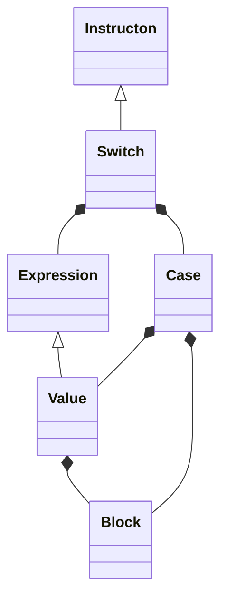

#### 1. Questions de cours

##### Question 1

```flow
lex=>operation: (词法分析) Analyse Lexicale
ulex=>operation: (词法单元) Unite Lexicale
syn=>operation: (语法分析) Analyse Syntaxique
sem=>operation: (语义分析) Analyse Semantique

lex(right)->ulex(right)->syn(right)->sem
```

- 词法分析是编译链的第一阶段，它允许将字符串转换为符号列表（词法单元、标记），例如数字、标识符或点。 词法分析的规范是使用正则表达式完成的。（为解析器提供词法单元）

  The lexical analysis is the first phase of the compilation chain, it allows the conversion of a character string into a list of symbols (lexical unit, token) such as a number, an identifier or a point. The specification of the lexical analysis is done using regular expressions. (Provides lexical units to parser)

- 句法分析器包括根据形式语法的规则突出程序的结构。 解析器被指定为一种语法，其产生规则可以包含语义动作。 （向语义分析器提供抽象树）

  The syntactic analyzer consists in highlighting the structure of a program, in accordance with the rules of a formal grammar. A parser is specified as a grammar whose production rules can contain semantic actions. (Provides the abstract tree to the semantic analyzer)

- 在编译中，语义分析是发生在句法分析之后、代码生成之前的阶段。 它对所考虑的编程语言的语义执行必要的检查，将信息添加到抽象语法树并构建符号表。 此分析执行的验证是：名称解析、类型验证、最终分配、代码生成。

  In compilation, semantic analysis is the phase occurring after syntactic analysis and before code generation. It performs the necessary checks on the semantics of the programming language considered, adds information to the abstract syntactic tree and builds the symbol table. The verifications performed by this analysis are: name resolution, type verification, final assignment, code generation.


##### Question 2 : The main objectives of the formal specification of the semantics of a language:

- 使用数学工具建模语义 Model semantics with mathematical tools
- 达到语法建模的质量 Achieving the quality of syntax modeling
- 研究连贯性和完整性 Study the coherence and the completeness
- 证明工具的正确性 Prove tool correctness
- 自动生成工具 Automatically generate tools


##### Question 3 : Difference between `Hérité` and `Synthétise`

- Hérité ( 降序 descending path )：在非终端分析之前计算 calculated before the analysis of the non-terminal
- Synthétise (升序 ascending path)：在非终端分析期间计算 calculated during the analysis of the non-terminal

属性分为两类：`Synthétise` 属性和 `Hérité` 属性。`Synthétise` 属性是属性评估规则的结果； 他们还可以使用 `Hérité` 的属性值。`Hérité` 属性从父节点传递给叶子。 

Attributes are divided into two groups: `Synthétise` attributes and `Hérité` attributes. The `Synthétise` attributes are the result of the attribute evaluation rules; they can also use `Hérité` attribute values. `Hérité` attributes are passed to leaves from parent nodes.

在某些方法中，`Synthétise` 属性用于将语义信息传递到树的根。 同样，`Hérité` 属性可以将语义信息传递给叶子

In some approaches, `Synthétise` attributes are used to pass semantic information to the root of the tree. Similarly,  `Hérité` attributes make it possible to pass semantic information to the leaves.


##### Question 4 

略


#### 2. Semantique attribuee

> 如果是非 LL(1) 型文法，要先消除左递归，将其转化为 LL(1) 型文法。


```ocaml
P:
	F -> N d N			(* 1 *)
	F -> m N d N		(* 2 *)
	N -> c S				(* 3 *)
	S -> Λ					(* 4 *)
	S -> c S				(* 5 *)
```

Rules:

```java
F.val = N1.val / N2.val;							// 1
F.val = - N1.val / N2.val;						// 2
N.val = c.val * 10^(S.prof) + S.val;	// 3
S.prof = 0;														// 4
S1.prof = S2.prof + 1;								// 5
S1.val = c.val * 10^(S2.prof) + S2.val;
```


#### 3. Traitement par cas en miniML

```ocaml
match (1+2) with
	| 1 -> 0 (* cas de valuer 1 *)
	| 3 -> 1 (* cas de valuer 3 *)
	| _ -> -1 (* cas de default *)
```

`Expr -> match Expr with | Val -> Expr | ... | Val -> Expr | _ ->  Expr`

##### 3.1 Operational semantic without error

$\gamma \vdash match \; e \; with \; | \; v_1 \to e_1\; | \; v_2 \to e_2\;|...| \;v_n \to e_n\; | \; \_ \to e_d\quad \Rightarrow v$

- 有匹配结果的情况：

$$
\frac
{\gamma \vdash e \Rightarrow v_i, v_i \ne \bot \qquad \gamma \vdash e_i \Rightarrow v}
{\gamma \vdash match \; e \; with \; | \; v_1 \to e_1\; | \; v_2 \to e_2\;|...| \;v_n \to e_n\; | \; \_ \to e_d\quad \Rightarrow v}
$$

- 无匹配的情况：

$$
\frac
{\gamma \vdash e \Rightarrow v_{\_}, v_{\_} \ne \bot , v_{\_} \notin\{v_1, v_2,..., v_n\} \qquad \gamma \vdash e_d \Rightarrow v}
{\gamma \vdash match \; e \; with \; | \; v_1 \to e_1\; | \; v_2 \to e_2\;|...| \;v_n \to e_n\; | \; \_ \to e_d\quad \Rightarrow v}
$$

##### 3.2 Operational semantic with error $\bot_c$

$\gamma \vdash match \; e \; with \; | \; e_1 \to v_1\; | \; e_2 \to v_2\;|...| \;e_n \to v_n\; | \; \_ \to e_d\quad \Rightarrow \bot_c$
$$
\frac
{\gamma \vdash e \Rightarrow v_i, v_i = \bot \qquad \gamma \vdash e_i \Rightarrow v}
{\gamma \vdash match \; e \; with \; | \; v_1 \to e_1\; | \; v_2 \to e_2\;|...| \;v_n \to e_n\; | \; \_ \to e_d\quad \Rightarrow \bot_c}
$$

##### 3.3 Type rule

$\gamma \vdash match \; e \; with \; | \; v_1 \to e_1\; | \; v_2 \to e_2\;|...| \;v_n \to e_n\; | \; v_{\_} \to e_{\_}\quad : \tau$
$$
\frac
{\gamma \vdash e:\tau_1 \quad \gamma \vdash v_i:\tau_1, \forall v_i \in \{v_1,v_2,...,v_n, v_{\_}\} \quad \gamma \vdash e_i :\tau}
{\gamma \vdash match \; e \; with \; | \; v_1 \to e_1\; | \; v_2 \to e_2\;|...| \;v_n \to e_n\; | \; v_{\_} \to e_{\_}\quad : \tau}
$$

##### 3.4 TYPE : Function `ruleMatch`

```ocaml
type ast =
	| ...
	| MatchNode of ast * ((ast * ast) list) * ast
```

```ocaml
let rec type_of_expr expr env = match expr with
	| ...
	| (MatchNode selection choix defualt) -> ruleMatch selection choix default env
```

我们需要用到 `unfiy t1 t2` 函数来比较两个 `type` 是否一致：

```ocaml
(* .........................................................  *)
(* unify ：typeType -> typeType *)
(*			-> typeType * bool 			*)
(* unify 可以比较输入的2种类型, 如果匹配则为 true, 返回值是第一种类型	*)
(* 否则为 false, 返回 ErrorType *）
(* .........................................................  *)
```

```ocaml
ruleMatch selection choix default env = 
	let e_type = (type_of_expr selection env) in
		let e1_type = (type_of_expr [e1,_]::[tl] env) in
			let e2_type = (type_of_expr [e2,_]::[tl] env) in
				...
				let en_type = (type_of_expr [en,_]::[tl] env) in
					let _type _bool = unify e_type (unify e1_type(...(unify en1_type en_type))) in
						if _bool then
							_type
						else
							ErrorType
```

##### 3.5 VALUE : Function `ruleMatch`

```ocaml
let rec value_of_expr expr env = match expr with
	| ...
	| (MatchNode selection choix defualt) -> ruleMatch selection choix default env
```

```ocaml
ruleMatch selection choix default env = 
	let eval = (value_of_expr selection env) in
		match eval with
			| (ErrorValue _) as result -> result
			| v_1 -> (value_of_expr e1 env)
			| v_2 -> (value_of_expr e2 env)
			...
			| v_n -> (value_of_expr en env)
			| _ -> | (value_of_expr default env)
```


#### 4. Instruction de choix en Bloc

```assembly
/* int i = 0 */
PUSH 1
LOADL 0
STORE (1) 0[SB]

/* switch (i+1) 相当于 */
/* i = i + 1 */
PUSH 1
LOADL 1
LOAD (1) 0[SB]
SUBR IAdd
STORE (1) 1[SB]

/* case 0 : { print 0; } 分解为 */
/* if (i == 0) print 0; */
LOAD (1) 1[SB]
LOADL 0
SUBR IEq
JUMPIF (0) jump_case_1
/* print 0 */
LOADL 0
SUBR IOut
JUMP jump_fin

/* case 1 : { print 1; } 分解为 */
/* if (i == 1) print 1; */
jamp_case_1
LOAD (1) 1[SB]
LOADL 1
SUBR IEq
JUMPIF (0) jamp_case_5
/* print 1 */
LOADL 1
SUBR IOut
JUMP jump_fin

/* case 5 : { print 5; } 分解为 */
/* if (i == 5) print 5; */
jamp_case_5
LOAD (1) 1[SB]
LOADL 5
SUBR IEq
JUMPIF (0) jamp_case_default
/* print 1 */
LOADL 5
SUBR IOut
JUMP jump_fin

/* case defaulf : {print -1} */
jamp_case_default
LOADL -1
SUBR IOut
JUMP jump_fin

jump_fin
HALT
```


##### 4.1 V erification et construction de l'arbre abstrait

(a)



(b)

```java
class Switch extends Instruction{
  Expression experssion;
  List<Case> cases;
  Default defaut;
  
  public Switch (Expression _experssion, List<Case> _case, Default _default){
    this.value = _experssion;
    this.cases = _case;
    this.defaut = _default;
  }
}
```


##### 4.2 Gestion de la table des symboles

(a) traitements necessaire pour gerer le TDS

- `CollectAndBackwardResolve(TDS);`
  1. recursive call on `Expression`
  2. Iterate over the list of all `cases` & recursive call on `block`
  3. recursive call on `block` by `default`
- `FullResolve();`

(b)

```java
boolean collectAndBackwardResolve(TDS tds){
  boolean result = true;
  result = this.expression.collectAndBackwardResolve(tds);
  for (Case c: this.cases){
    result = result && c.getBlock().collectAndBackwardResolve(tds);
  }
  result = result && this.defaut.getBlock().collectAndBackwardResolve(tds);
  return result;
}
```

```java
boolean fullResolve(TDS tds) {
  boolean result = true;
	for (Case c: this.cases) {
		result = result && c.getBlock().fullResolve(tds);
  }
	result = result && this.expression.fullResolve(tds) && this.defaut.fullResolve(tds);
	return result;
}
```


##### 4.3 Type

(a) traitements necessaire pour gerer le typage

1. Typage de l'`expression`
2. Iterate over the list of all `cases`
   - Check that `value` same type as `expression`
   - Recursive call on `block`
3. Recursive call on `block` by `default`

(b)

```java
boolean checkType() {
  boolean result = true;
  Type type = this.expression.getType();
  for(Case c : this.cases){
    result = result && c.getValue.compareWith(type);
    result = result && c.getBlock.checkType();
  }
  result = result && this.defaut.checkType();
  return result;
}
```


##### 4.4 Generation de code

(a) traitements necessaire pour gerer la generation de code

1. Reserve spaces for results ( `PUSH size_result` )
2. Generate code for `expression`
3. 将结果分配给变量 assign the result to the variable ( `STORE (size_result) @_result` )
4. Iterate over the list of all `cases`
   - Read the value of result ( `LOAD (size_result) @_result` )
   - Load value associated with the case `c` ( `LOADL case_value` )
   - Comparer ( `SUBR IEq` )
   - If the judgment condition is not met, jump to the else branch ( `JUMPIF (0) case_else` )
   - Generate the code of the `block` associated with the case `c`
   - Jump to the `fin` branch ( `JUMP case_fin` )
   - Generate `case_else` label
5. Generate code for `defaut`
6. Generate `case_fin` label